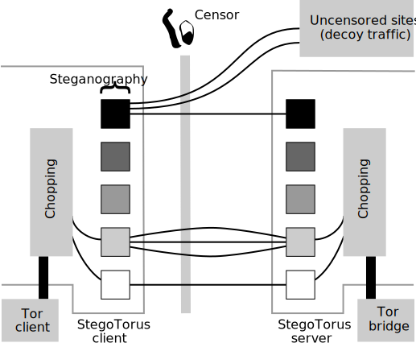

# Stegotorus

**Stegoturs** is a Free (as in freedom) pluggable transport (PT: [IntroPT]) development framework, streamlining the job of developing smarter and
stealthier pluggable transports than the conventional ones currently in use. Stegotorus framework provides an API specifically geared towards the needs of steganographic protocols. Using these API, developers can write PTs which can effectively hide from deep packet inspector systems (DPI), but also resist nondiscriminatory adversarial behaviours such as throttling or packet and connection dropping.

Stegotorus disentangles the part of the PT code which manages the network communications from the part responsible for encoding the information. In the Stegotorus jargon, the former is known as *protocol* and the latter - as *steg modules*. A system can have several protocols and steg modules working together. In this way, different censorship countermeasures can be developed to bypass censorship in modular forms. As well, one or many modules can be used in different situations.

At the heart of Stegotorus is the chopper protocol. Chopper implements a protocol similar to TCP/IP over the network transport layer. It chops the network flow in small chunks which are encodable by the Steg modules. It keeps track of them and ensures that they arrive safely to the other side or otherwise tries to send them again, perhaps through another route (proxy server). Additionally, chopper encrypts all of the network traffic.

The steg modules receive chunks from the chop and try to encode them in a format appropriate to be sent on the network and being observed by the censor. This could be, for example, encoding the traffic into another traffic considered benign by the censor.

Currently, two main steg modules has been implemented, namely the *NoSteg module* and the *HTTP steg module*. The NoSteg module does not perform any special encoding on the data and should be used when only the Chopper's capabilities are desired. The HTTP Steg module encodes data chunks in HTTP traffic. Based on the way the HTTP cover traffic is generated or obtained, there are three different flavors of this HTTP Steg module that are available.

Further details on the Stegotorus design can be found in the Stegotorus paper [StegoTorus: a camouflage proxy for the Tor anonymity system (2012)](./doc/stegotorus_paper_css12.pdf).

[IntroPT]: https://www.pluggabletransports.info/how-transports/ "What Pluggable Transports do"

**Warning:** Stegotorus is still under development and has not been rigorously audited. Some features are still experimental, and security issues might still exist in the code.

## How to build

Stegotorus has been (cross) built over GNU/Linux and for GNU/Linux, Android and 
MS-Windows. We expect that it can be compiled for other POSIX systems.

### Build requirements

To build Stegotorus you need:

* git
* autoconf
* automake 
* pkgconfig
* openssl >= 1.1.1
* libevent
* libcurl
* yaml-cpp
* zlib

If you intend to run a Stegotorus server on the same machine which runs an HTTP server and use the HTTP server files as the cover for the Stegotorus traffic you also need:

* libboost
* libboost-system
* libboost-filesystem

To compile for GNU/LINUX you need:

* gcc

In a Debian-based GNU/Linux OS you would get these packages by running:

    $ sudo apt-get install build-essential git automake autoconf pkg-config libssl-dev libevent-dev libcurl4-openssl-dev libyaml-cpp-dev zlib1g-dev libboost-dev libboost-system-dev libboost-filesystem-dev

If the OpenSSL library in the official distribution repository is older than 1.1.1, you might need to obtain the latest version by 
downloading it from the [OpenSSL website]([https://www.openssl.org/source/openssl-1.1.1b.tar.gz]).

For cross-compiling for MS-Windows you will need:

* mingw-64

For cross-compiling for Android you need:

* android-ndk >= r19

Finally, you need to clone the Stegtorus repo:

    $ git clone https://github.com/TheTorProject/stegotorus.git
    $ cd stegotorus

### Build for GNU/Linux

Assuming all installation requirements are met:

    $ autoreconf -i
    $ ./configure [--without-boost]
    $ make

### Build for MS-Windows

You need the binary of all the libraries mentioned above and cross-compiled for MS-Windows and accessible to mingw-w64. The binary of these libraries cross-compiled for MS-Windows is accessible from the Stegotorus release page: [Stegotorus Releases](https://github.com/TheTorProject/stegotorus/releases)

Assuming that your compiler has access to these libraries as well as to their header files:

    $ autoreconf -i
    $ scripts/build-windows.sh
    
### Build for Android
You need the binary of all the libraries mentioned above and cross-compiled for Android. You can download the binary of these libraries cross-compiled for Android from the Stegotorus release page: [Stegotorus Releases](https://github.com/TheTorProject/stegotorus/releases)

You also need the header files for those libraries. You can download binary of these libraries cross-compiled for MS-Windows here:

    $ export NDK_DIR=/path/to/android-ndk-dir/
    $ export ANDROID_INCLUDE_DIR=/path/to/cross-compiled-libraries/headers/
    $ export ANDROID_LIB_DIR=/path/to/cross-compiled-libraries/binaries/
    $ autoreconf -i
    $ scripts/build-android.sh

### Running tests

Stegotorus needs Python 2 to be able to run integration tests.

To run unit and integration tests:

    $ make check

Note that some tests might fail if they do not have access to proper cover traffic.

## Deploying Stegotorus 

If you want to:
   - Know more about Stegotorus options
   - Test Stegotorus in practice
   - Run a Stegotorus server to help users with Stegotorus clients
   - Write an application with Stegotorus support

please read: [Stegotorus user guide](./doc/stegotorus_user_guide.md)

## Developing a new Steg module 

If you want to write a new Steg module, to encode network traffic in a specific way or to adapt an existing pluggable transport into a Steg module, please read the [Stegotorus Developer Guide](./doc/stegotorus_developer_guide.md)
